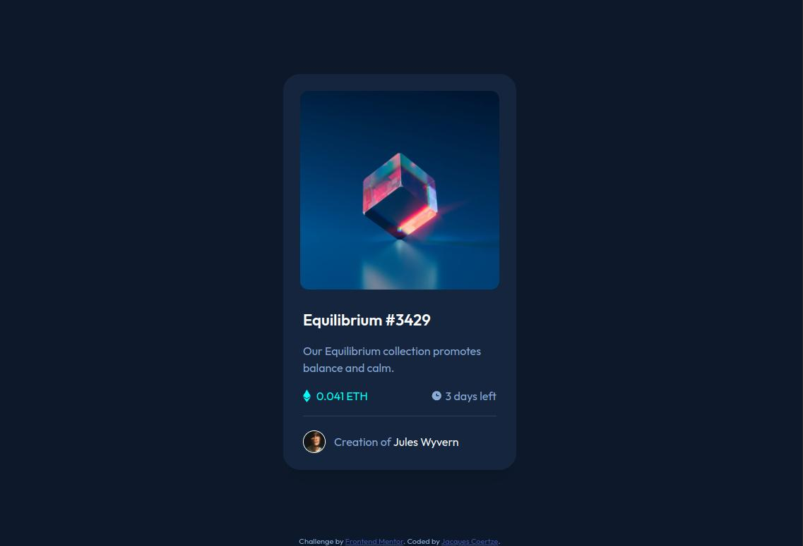

# Frontend Mentor - NFT preview card component solution

This is a solution to the [NFT preview card component challenge on Frontend Mentor](https://www.frontendmentor.io/challenges/nft-preview-card-component-SbdUL_w0U). Frontend Mentor challenges help you improve your coding skills by building realistic projects.

## Table of contents

- [Overview](#overview)
  - [Screenshot](#screenshot)
  - [Links](#links)
- [My process](#my-process)
  - [Built with](#built-with)
  - [Useful resources](#useful-resources)
- [Author](#author)
- [Acknowledgments](#acknowledgments)

## Overview

### Screenshot

#### Desktop Version

#### Mobile Version

### Links

- Solution URL: [https://github.com/Tripex48/FEM_nft-preview-card-component](https://github.com/Tripex48/FEM_nft-preview-card-component)
- Live Site URL: [https://Tripex48.github.io/FEM_nft-preview-card-component](https://Tripex48.github.io/FEM_nft-preview-card-component)

## My process

### Built with

- Semantic HTML5 markup
- Tailwind CSS
- Grid and Flexbox
- Mobile-first workflow

### Useful resources

- [Tailwind CSS cheatsheet](https://nerdcave.com/tailwind-cheat-sheet) - A convenient cheatsheet showing the different Tailwind CSS utility classes.
- [Tailwind CSS plugin for Prettier](https://github.com/tailwindlabs/prettier-plugin-tailwindcss) - A Prettier plugin that automatically sorts utility classes based on the [Tailwind CSS recommended class order](https://tailwindcss.com/blog/automatic-class-sorting-with-prettier#how-classes-are-sorted).
- [Tailwind hover and hover groups](https://tailwindcss.com/docs/hover-focus-and-other-states#styling-based-on-parent-state) - Official TailwindCSS documentation showing the usage of the `hover` and `group` utility classes.
- [Tailwind custom styles](https://tailwindcss.com/docs/adding-custom-styles#adding-custom-utilities) - Official TailwindCSS documentation showing how to add custom classes.
- [Hsl to Hex color conversion](https://htmlcolors.com/hsl-to-hex) - A useful color converter to convert HSL to Hex for inclusion in the Tailwind CSS config file.
- [Image overlay hover effect](https://www.geeksforgeeks.org/how-to-create-image-overlay-hover-using-html-css/) - An article illustrating how an image overlay effort can be created.

## Author

- Frontend Mentor - [@Tripex48](https://www.frontendmentor.io/profile/Tripex48)
- Twitter - [@jcoertze](https://www.twitter.com/jcoertze)

## Acknowledgments

Thank you to FrontEnd Mentor for providing this challenge.
